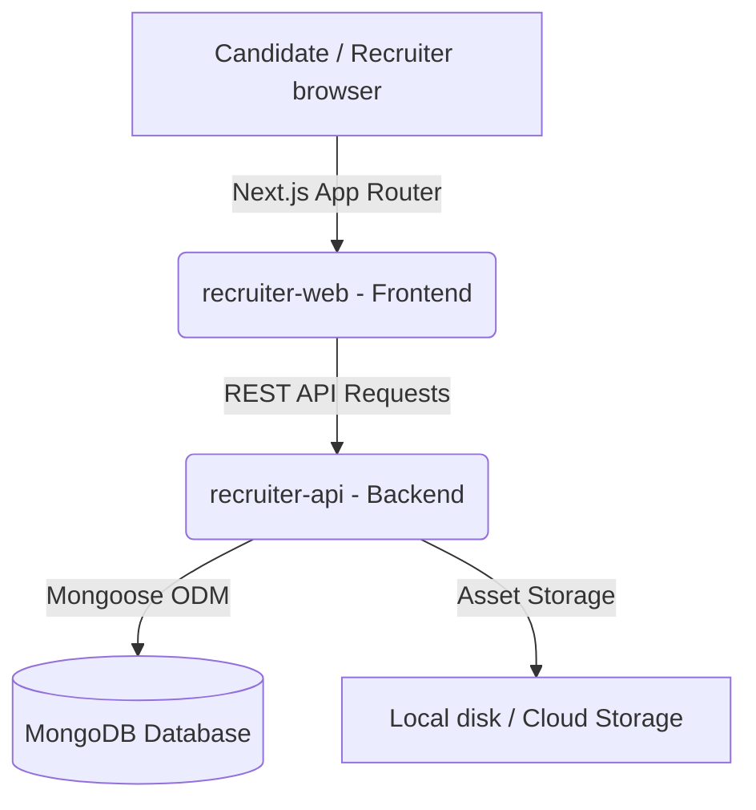

# 💜 HYREME Platform

Welcome to **HYREME**, a next-generation AI-powered recruitment platform designed to connect senior recruiters with top talent through dynamic, immersive candidate reels and automated interview workspaces.

The platform is structured as a robust monorepo containing:
1. **Recruiter OS & Candidate Studio (`recruiter-web/`)**: A fast Next.js v16 + React v19 application styled with Tailwind CSS v4, featuring a Reels-style discovery feed and rich candidate profile editors.
2. **Core Backend Service (`recruiter-api/`)**: A Node.js + Express + TypeScript backend API driving authentication, resume/video assets uploads, and database integrations.
3. **Shared Contracts (`shared/`)**: Shared Typescript interfaces, database schemas, and validation logic.

---

## 🏗️ System Architecture & Setup



### 1. Prerequisites
- **Node.js**: `v18.x` or higher installed.
- **MongoDB**: A running local MongoDB instance or a **MongoDB Atlas** Cloud Database cluster.

### 2. Monorepo Structure & Local Setup

#### Step A: Configure the Backend API (`recruiter-api/`)
1. Navigate to the api directory:
   ```bash
   cd recruiter-api
   ```
2. Install dependencies:
   ```bash
   npm install
   ```
3. Create a `.env` file based on `.env.example`:
   ```ini
   PORT=4000
   MONGO_URI=mongodb://127.0.0.1:27017/hyreme
   JWT_SECRET=your_jwt_secret_token_here
   ```
4. Run the seed script to populate the database with mock candidate reels:
   ```bash
   npm run seed
   ```
5. Start the backend developer server:
   ```bash
   npm run dev
   ```

#### Step B: Configure the Frontend (`recruiter-web/`)
1. Navigate to the web directory:
   ```bash
   cd ../recruiter-web
   ```
2. Install dependencies:
   ```bash
   npm install
   ```
3. Create a `.env.local` file based on `.env.example`:
   ```ini
   NEXT_PUBLIC_API_URL=http://localhost:4000/api
   ```
4. Run the Next.js development server:
   ```bash
   npm run dev
   ```

Open [http://localhost:3000](http://localhost:3000) to access the platform!
- **Recruiter Account**: `ritika@hyreme.io` / `Hyreme@123`
- **Candidate Account**: Register a new one via the signup page.

---

## 🚀 Deployment Guide (From Scratch)

To host the entire platform in production, deploy the database, backend, and frontend separately.

### Phase 1: Database (MongoDB Atlas)
1. Go to [MongoDB Atlas](https://www.mongodb.com/cloud/atlas) and sign up for a free tier account.
2. Create a new cluster and build a database named `hyreme`.
3. In **Database Access**, create a user with a secure password.
4. In **Network Access**, whitelist `0.0.0.0/30` or add your server's hosting IP address.
5. Copy your **MongoDB Connection URI**. It will look like:
   `mongodb+srv://<username>:<password>@cluster.mongodb.net/hyreme?retryWrites=true&w=majority`

---

### Phase 2: Backend API (Render / Railway / Heroku)
You can deploy `recruiter-api` to a platform like **Render**, **Railway**, or **AWS Elastic Beanstalk**.

#### Step-by-Step with Render:
1. Log in to [Render](https://render.com) and click **New > Web Service**.
2. Connect your GitHub repository containing the monorepo.
3. Configure the following service settings:
   - **Name**: `hyreme-api`
   - **Environment**: `Node`
   - **Root Directory**: `recruiter-api` *(Crucial: sets context to the backend folder)*
   - **Build Command**: `npm install && npm run build`
   - **Start Command**: `node dist/index.js`
4. Go to the **Environment** tab and add your Production Variables:
   - `PORT`: `10000` (or leave empty as Render assigns it automatically)
   - `MONGO_URI`: `mongodb+srv://...` *(Your MongoDB Atlas URI)*
   - `JWT_SECRET`: `a_highly_secure_random_string`
5. Click **Deploy Web Service** and copy your live API endpoint URL (e.g. `https://hyreme-api.onrender.com`).

---

### Phase 3: Frontend Web (Vercel)
**Vercel** is the recommended host for Next.js applications.

#### Step-by-Step with Vercel:
1. Log in to [Vercel](https://vercel.com) and click **Add New > Project**.
2. Select your GitHub repository.
3. Configure the project:
   - **Framework Preset**: `Next.js`
   - **Root Directory**: `recruiter-web` *(Crucial: sets context to the frontend folder)*
   - **Build Command**: `next build`
   - **Output Directory**: `.next`
4. Expand **Environment Variables** and add:
   - `NEXT_PUBLIC_API_URL`: `https://hyreme-api.onrender.com/api` *(Your live backend URL + /api)*
5. Click **Deploy**. Vercel will build, optimize, and serve your app globally.

---

## 📦 Preparing for Git & Pushing to GitHub

We have configured a master `.gitignore` at the root of the workspace to prevent environment variables and heavy build caches from being pushed.

### 1. Initialize & Verify Git Status
From the root directory, check what files will be committed:
```bash
git status
```
*Note: Make sure that only your custom code is staged for addition, and heavy directories like `.next/`, `node_modules/`, and `.env` are completely ignored.*

### 2. Stage and Commit
1. Add all project files:
   ```bash
   git add .
   ```
2. Commit your clean files with a descriptive message:
   ```bash
   git commit -m "feat: complete UI/UX optimization, responsive overlays, and deploy config"
   ```

### 3. Push to your GitHub Repository
Create a repository on GitHub and link/push your local files:
```bash
git remote add origin https://github.com/your-username/hyreme-platform.git
git branch -M main
git push -u origin main
```
